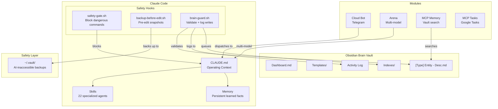

# Architecture

## System Diagram

## Data Flow

1. **User input** → Claude Code reads CLAUDE.md for context
2. **Bash commands** → safety-gate.sh checks deny patterns → blocks or allows
3. **File edits** → backup-before-edit.sh snapshots → edit proceeds → brain-guard.sh validates
4. **Brain writes** → brain-guard.sh validates frontmatter, logs to Activity Log, queues index refresh
5. **Search** → MCP Memory searches vault via TF-IDF scoring
6. **Telegram** → Cloud Bot receives message → dispatches to Claude Code → sends response

## Key Principles

1. **Safety first**: Every destructive action is blocked or backed up
2. **Flat vault**: All Brain files at root level for speed
3. **Type-first naming**: `[Type]` prefix enables instant categorization
4. **Frontmatter as metadata**: Enables Dataview queries and validation
5. **AI-inaccessible backups**: `~/.vault/` is deny-listed in all tools
