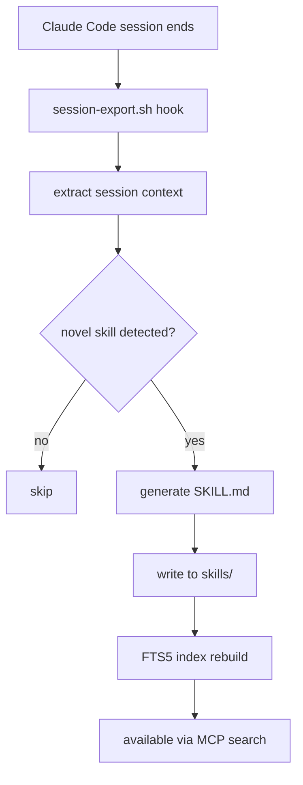

# Skill Engine

Python-based self-improving skill system. Detects novel task completions, generates reusable skill files, indexes them in SQLite FTS5 for retrieval.

## Architecture
- `engine.py` — core skill detection and generation logic
- `mcp_server.py` — MCP server interface for Claude integration
- `index.py` / `skills.db` — SQLite FTS5 index for skill search
- `watcher.py` — watches for new skill triggers
- `loader/` — skill file loading and parsing
- `learned/` — generated skill files (output)

## Architecture Diagram

## Review Focus
- SQLite FTS5 indexing correctness — search ranking, tokenization
- Skill ID generation — hash collisions in `make_skill_id()`
- File I/O safety — concurrent reads/writes to `learned/` directory
- Confidence thresholds — novelty detection logic, false positive rate
- MCP server input validation — zod schemas on tool inputs
